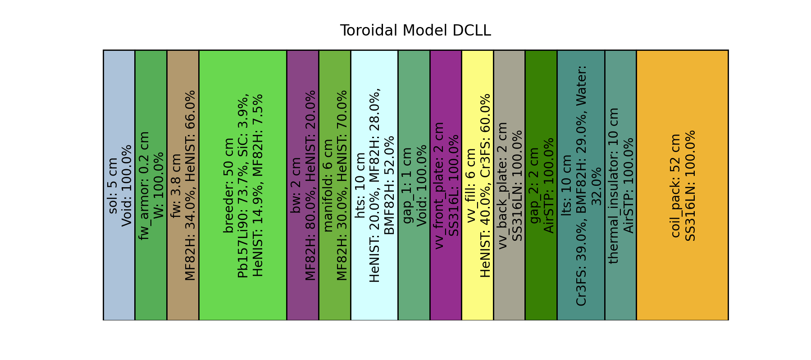

## Workflow for using `radial_build_tools` and `fusion-materials-db`
This process uses the [`fusion-materials-db`](https://github.com/svalinn/fusion-material-db) to create a JSON file that defines the composition of materials used in a simulation, like an OpenMC or MCNP model. The examples are for OpenMC with the use of a function to create an OpenMC materials object from the JSON file. This is used with [`radial_build_tools`](https://github.com/svalinn/radial_build_tools) to generate a model for OpenMC (geometry and materials). The result is a "model.xml" file and a visual of the geometry, an example is shown below.



Steps
1. Create Materials Dictionary file
    1. Import [`material_db_tools.py`](https://github.com/svalinn/fusion-material-db/blob/main/material-db-tools/material_db_tools.py)
    2. Open [`PureFusionMaterials_libv1.json`](https://github.com/svalinn/fusion-material-db/blob/main/db-outputs/PureFusionMaterials_libv1.json)
    3. Create dictionary with each entry of the form:     
    ```
    "<material_name>": {
        "composition": {"<material_component>": <fraction>, ...},
        "citation": "<citation>",
    },
    ```
    adding `"density_factor"` when needed
    
    4. More detail given in [`material_db_tools.py`](https://github.com/svalinn/fusion-material-db/blob/main/material-db-tools/material_db_tools.py)
    5. Export to JSON file
    6. Examples: [`dcll_materials.py`](https://github.com/svalinn/radial_build_tools/tree/main/examples/dcll_hcpb_examples/dcll_radial_build_example/dcll_materials.py) [`HCPB_Mix_Materials.py`]()
2. Create build file
    1. Import JSON to openmc function [`dcll_json_to_openmc.py`](https://github.com/svalinn/radial_build_tools/tree/main/examples/dcll_hcpb_examples/dcll_radial_build_example/dcll_json_to_openmc.py) or [`openmc_Materials_Object_from_json.py`]()
    2. Import `ToroidalModel` from [`radial_build_tools.py`](https://github.com/svalinn/radial_build_tools/blob/main/radial_build_tools.py)
    2. Set major and minor radii 
    3. Call JSON to openmc function with JSON file and path to cross_sections file
    4. Create nested build dictionary of the form:
    ```
    "<part_name>": {"thickness": <thickness>,
        "scores": ["<score>"],
    },
    ``` 
    5. If layer is void add `"composition": {"Void": 1.0}` to the dictionary
    6. Call `TorodialModel`
    7. Examples: [`dcll_radial_build.py`](https://github.com/svalinn/radial_build_tools/tree/main/examples/dcll_hcpb_examples/dcll_radial_build_example/dcll_radial_build.py) [`HCPB_Build_Dict.py`]()
